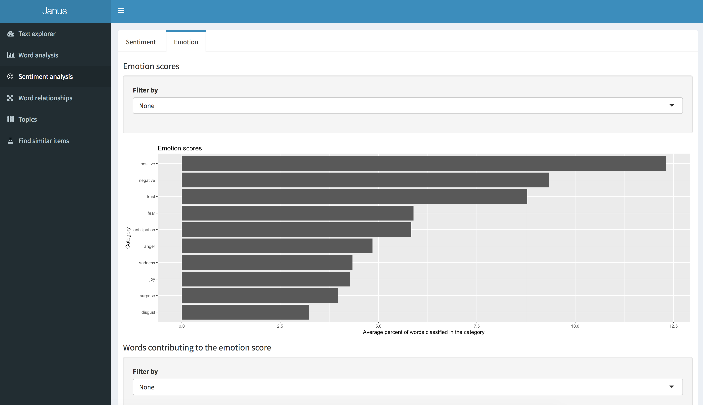

# Getting started

Make sure *export.csv* is in the data folder and then run `python 00-build.py` which runs the various scripts to create the models and data tables.  

Once complete launch the dashboard by running *shiny-dashboard/app.R* in Rstuido or by `R shiny::runApp("shiny-dashboard/app.R")`


#### Environment variables

You need R => 3.3 added to the system path so that R and Rscript run from the shell, as well as python 3.

## Dependencies

#### Feather

The [feather](https://github.com/wesm/feather) package is used to transfer data frames between R and Python. 
Install it in R using `install.packages(feather)` and for python `pip install feather-format`. For Python I received an error message and had to download some microsoft libraries using the link provided in the error message.

#### NLTK

The python natural language toolkit [NLTK](http://www.nltk.org/) was pre-installed on Anaconda. We make use of wordnet and stopwords, which have to be downloaded by running 

```python
import nltk
nltk.download()
```

and using the GUI that pops up to install wordnet and stopwords.

#### R packages

Many R packages are used. Each can be installed with `install.packages(package_name)`. 


| Package                                  | Description                              |
| ---------------------------------------- | ---------------------------------------- |
| tidyverse                                | Better than using base R for data manipulation and visualization. See the [R for data science book](http://r4ds.had.co.nz/). |
| tidytext                                 | Text processing in R. See the [tidy text mining with R](http://tidytextmining.com/) book. |
| [shiny](https://shiny.rstudio.com/)      | Web app framework                        |
| [shinydashboard](https://rstudio.github.io/shinydashboard/) | Dashboard layout with bootstrap.         |
| stringr                                  | Package to manipulate strings with the tidyverse syntax |
| feather                                  | Import and export data frames for use in Python |
| topicmodels                              | Topic modeling using LDA algorithm       |
| wordcloud                                | Make pretty word clouds                  |
| reshape2                                 | Manipulate data (can re-write code to use tidyverse instead) |
| [LDAvis](https://github.com/cpsievert/LDAvis) | Visualise the topics of a LDA model      |
| [igraph](http://igraph.org/r/)           | Create a graph                           |
| [ggraph](https://github.com/thomasp85/ggraph) | Plot a graph                             |

to install everything

```R
pkgs <- c("tidyverse", "tidytext", "tm", "shiny", "shinydashboard", "stringr", "feather", "topicmodels", "wordcloud", "reshape2", "LDAvis", "igraph", "ggraph")
install.packages(pkgs)
```

then go grab a coffee.


